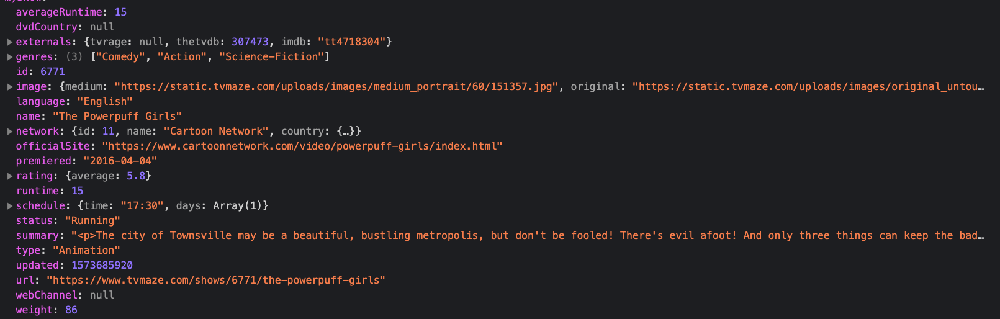

# TV show

This app shows all episodes of "Powerpuff Girls" TV show and the episode page.

## Demo

You can see the demo here:
https://tv-maze-api.vercel.app/

  
## Installation

Install TvMaze-api with npm

npm:

```bash
cd TvMaze-api

npm install
```

yarn:

```bash
yarn
```
    

 
## Deployment


To Start this project run

npm:

```bash
npm run start
```

yarn:

```bash
yarn start
```
    

  
  To build the project run:

npm: 

  ```bash
  npm run build
```

yarn:

```bash
yarn build
```


## API Reference

For the api, I used TV Maze API.

#### Get TV Show details

```http
  GET https://api.tvmaze.com/shows/${id}
```




 

#### Get TV show Episodes

```http
  GET https://api.tvmaze.com/shows/${id}/episodes
```

 

#### Get episode details

```http
  GET https://api.tvmaze.com/episodes/${id}
```


 
  

